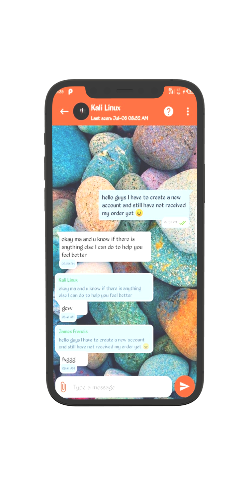
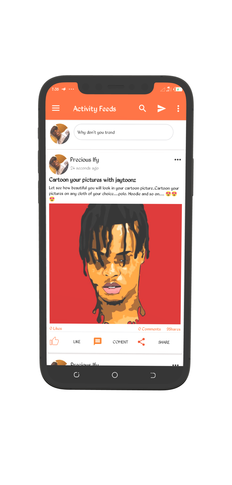
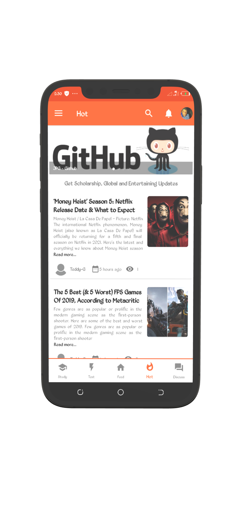
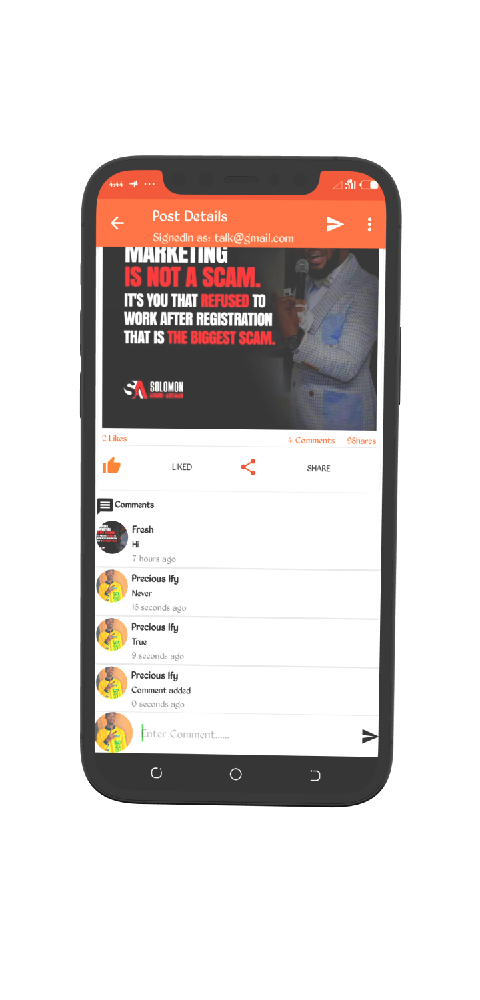
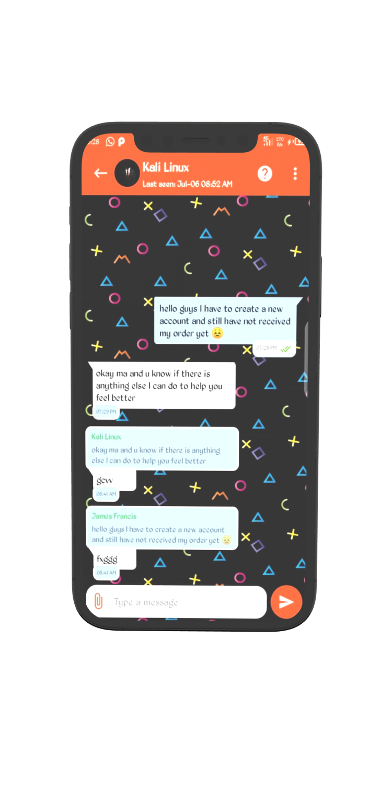

# SocialGage
  An Educative social media.

## Libraries
*   [Gson](https://github.com/google/gson) : An Object-to-JSON serialization/deserialization library
*   [Volley](https://developer.android.com/training/volley) :Volley is an HTTP library that makes networking for Android apps easier and most importantly, faster
*   [Glide](https://github.com/bumptech/glide) : Glide is a fast and efficient open source media management and image loading framework for Android
*   [PhotoView](https://github.com/Baseflow/PhotoView) : PhotoView aims to help produce an easily usable implementation of a zooming Android ImageView.

<h2 align="left">Screenshots</h2>
<h4 align="center">

 

  
  ##Author
  
  Agalaba Ifeanyi Precious
